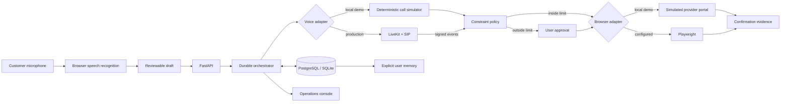

# Jeevan

**Voice and browser agent for completing household bookings.**

Jeevan accepts a spoken outcome such as “Book AC servicing this Saturday after 2 PM, under ₹1,000,” prepares a reviewable task draft, calls a provider, extracts a structured quote and slot, checks the user's limits, obtains approval when required, completes the booking through a bounded browser action, and stores provider evidence. An operations console exposes every decision and lets a person recover a blocked task.

This repository is a portfolio prototype built around the engineering problems behind a real personal-assistant product: microphone intake, tool use, durable workflows, approval gates, browser automation, long-term memory, and human handoff.

## Demo

```powershell
cd jeevan
python -m venv .venv
.\.venv\Scripts\Activate.ps1
python -m pip install -e ".[dev,browser]"
uvicorn app.main:app --reload
```

Open [http://127.0.0.1:8000](http://127.0.0.1:8000). The app seeds two editable preferences for `demo-user` on first load.

To use the microphone, open the app in a current Chrome or Edge browser on `localhost` or HTTPS, allow microphone access, and press **Start listening**. Say the sample request. Jeevan shows what it heard, extracts the service, date, time, maximum budget, and saved address, and speaks its interpretation. If it needs details, answer in the next voice turn; for example, “26 September 2026, after 2 PM, budget is 2500.” Review or edit the transcript and task fields, then say **“yes”** or **“start task”**, or press **Start this task**. For an above-budget quote, Jeevan speaks the provider, slot, price, and amount over budget. Say **“approve quote”** or **“decline quote”**. For a failed call, say **“retry call”**. Press **Stop voice session** to stop listening and speech output.

The browser's Web Speech API handles microphone transcription and speech output. Recognition availability varies by browser and may use a browser vendor's speech service. The editable form remains available if recognition is unsupported or microphone permission is denied. Voice intake is limited to AC servicing in this prototype; missing or unclear date, time, budget, service, or address is requested instead of silently defaulted. The `/api/v1/voice/interpret` endpoint only returns a draft: it does not create a task or call a provider.

The default configuration uses deterministic adapters and requires no API keys. Try these scenarios from **Demo scenario**:

- **Quote above budget:** pauses for version-bound approval before any booking action.
- **Within-budget booking:** proceeds to a provider confirmation and records evidence.
- **No answer / dropped call:** preserves state and succeeds after an explicit retry.
- **Price changes at confirmation:** rejects the stale approval and asks again.
- **No matching availability:** routes complete context to the operator console.

API documentation is available at [http://127.0.0.1:8000/docs](http://127.0.0.1:8000/docs).

The [75-second walkthrough](DEMO_WALKTHROUGH.md) shows an honest portfolio narrative. A [silent scripted UI capture](https://github.com/ssuraj2504/Jeevan/releases/tag/v0.1.0) shows the workflow with mocked speech input and simulated provider actions. The [capture tool](tools/record_scripted_demo.py) reproduces it; record your own microphone for an application video.

## Public sandbox mode

`PUBLIC_DEMO_MODE=true` enables an isolated, disposable portfolio demo. Each visitor gets a signed HttpOnly session cookie; the server scopes task reads and actions to that session, replaces any spoken or submitted address with a fictional demo address, and sanitizes stored task descriptions. Operator routes, memory edits, demo seeding, the webhook, and API docs are unavailable. Provider calling and booking must remain simulated. The mode requires a unique `DEMO_SESSION_SECRET` of at least 32 characters and `PUBLIC_BASE_URL` set to the exact site origin.

This mode is for fictional demo requests only. It caps tasks per session and across the instance but has no distributed rate limiter or automatic data cleanup. A single-instance SQLite deployment is disposable: tasks may disappear on restart. Do not use this mode to collect real addresses, phone numbers, or booking requests.

## Architecture



Every state change is appended to an audit timeline:

```text
requested → calling → quote_received → awaiting_approval → booking → completed
                    ↘ retry_scheduled                    ↘ needs_human
```

`completed` is unreachable unless the task has a provider confirmation reference. Calls and bookings have separate boundaries, and the provider booking table allows only one record per task.

## What is real and what is simulated

The microphone UI, spoken task review and commands, FastAPI application, persistence, policy checks, state machine, idempotency behavior, quote-version approval, memory CRUD, webhook validation, ops controls, metrics, and browser adapter are implemented. Browser speech recognition captures the user's request. Separately, the default provider-call adapter returns deterministic transcripts so reviewers can run every failure case without telephony accounts. Speaking into Jeevan does **not** place a real phone call in the default demo.

`app/livekit_worker.py` is the optional real-call worker. With `VOICE_ADAPTER=livekit`, the API dispatches that named worker into a task-specific room. The worker creates a LiveKit SIP participant for the provider number and uses tool calls to send structured, signed events back to the orchestration API. A real deployment still requires a LiveKit project, a compatible outbound SIP provider and phone number, model credentials, provider consent, and region-specific calling compliance.

The browser adapter has two modes:

- `BOOKING_ADAPTER=simulated` writes deterministic provider evidence directly.
- `BOOKING_ADAPTER=playwright` opens the included sandbox provider portal, fills only named fields, and reads the confirmation reference. It does not execute model-generated selectors or scripts.

To run the Playwright path:

```powershell
python -m playwright install chromium
$env:BOOKING_ADAPTER = "playwright"
uvicorn app.main:app --reload
```

## Real LiveKit calling

Install the optional worker and configure `.env` from `.env.example`:

```powershell
python -m pip install -e ".[voice]"
python -m app.livekit_worker dev
```

Set `VOICE_ADAPTER=livekit`, include the provider number in the task's `phone` field, and call the normal `/run` endpoint. Jeevan dispatches `jeevan-provider-caller` with metadata equivalent to:

```json
{
  "task_id": "<task UUID>",
  "phone_number": "+91...",
  "brief": "AC servicing, Saturday after 2 PM, budget Rs 1,000",
  "callback_url": "https://your-api.example/api/v1/webhooks/livekit"
}
```

The worker can only record a quote or report failure. Booking stays behind Jeevan's deterministic budget and approval policy. The mutating browser action is never exposed directly to the voice model.

## Tests and evaluation

```powershell
pytest
ruff check app tests
```

The suite covers valid and forbidden state transitions, budget boundaries, idempotent request replay, stale approval rejection, retry recovery, changed prices, operator recovery, tenant-scoped memory queries, authenticated webhook deduplication, and the invariant that a declined quote creates no booking.

To verify the provider portal and both local/public voice flows with a real browser while the server is running:

```powershell
$env:RUN_BROWSER_E2E = "1"
pytest -m browser
```

Metrics exposed at `/api/v1/ops/metrics` include completion rate, attention queue size, human handoff rate, and duplicate bookings. Before adding figures to a resume, run a documented evaluation set and report its size. Do not mix deterministic scenarios with real-call outcomes.

Useful evaluation targets:

- 0 tasks marked completed without provider evidence.
- 0 duplicate provider bookings under retries and event replay.
- 0 approval bypasses for prices above the user's limit.
- 0 cross-user memory records returned by scoped queries.
- Task completion and recovery rate by provider scenario.
- p50/p95 call latency and cost per completed real booking.

## Deployment

For a complete local container deployment with PostgreSQL:

```powershell
docker compose up --build
```

For a portfolio link on GCP, deploy the container to Cloud Run with `PUBLIC_DEMO_MODE=true`, simulated adapters, a secret supplied through Secret Manager, the exact HTTPS service URL as `PUBLIC_BASE_URL`, and a low maximum instance count. The Dockerfile honors Cloud Run's `PORT`. Cloud Run's local filesystem is ephemeral, so SQLite in this configuration is a throwaway demo store; visitors should expect tasks to reset. A real product deployment needs authenticated users/operators, a persistent managed database with migrations and retention policy, rate limiting, and separately deployed LiveKit workers.

## Repository map

```text
app/
├── main.py                 FastAPI routes and signed voice webhook
├── services.py             durable workflow, policies, audit events
├── domain.py               explicit state-transition graph
├── models.py               tasks, events, memories, bookings
├── livekit_worker.py       optional outbound voice worker
├── integrations/
│   ├── voice.py            deterministic voice adapter boundary
│   └── browser.py          simulated and Playwright adapters
└── web/                    customer request UI and ops console
tests/                      workflow, policy, memory and webhook tests
```

## Current limitations

- Demo authentication is intentionally omitted; user and operator identity must be derived from production auth before handling real personal data.
- The prototype supports one service type and one provider portal.
- Microphone recognition depends on browser support and permission, and speech intake is currently English (India). There is no server-side transcription fallback or always-on listening mode.
- Retry scheduling is explicit in the demo. A production deployment should enqueue retries in a durable worker rather than relying on an API process.
- Provider recordings and transcripts need consent, retention controls, encryption, and redaction before real use.
- The included memory store accepts only explicit user preferences and completion history; it does not promote inferred details automatically.

## Portfolio demo outline

1. Speak the default request, show the interpreted draft, and point out that Jeevan retrieves the saved address without starting a task yet.
2. Show the structured call transcript and the ₹1,150 quote.
3. Explain why the workflow stops at approval and why approval is tied to a task version.
4. Approve, then show the provider confirmation reference and audit event.
5. Open Operations and demonstrate the failed-call recovery scenario.
6. Open Memory, edit a preference, and show its source.
7. End with the test results and an honest split between deterministic and real calls.
